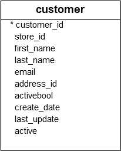

# Getting started

### What is PostgreSQL
PostgreSQL is an advanced, enterprise-class, and open-source relational database system.
PostgreSQL supports both SQL (relational) and JSON (non-relational) querying.

PostgreSQL is a highly stable database backed by more than 20 years of development by the open-source community.

# Querying Data

## SELECT
One of the most common tasks, when you work with the database, is to query data from tables by using the `SELECT` statement.

The `SELECT` statement is one of the most complex statements in PostgreSQL. It has many clauses that you can use to form a flexible query.

The `SELECT` statement has the following clauses:

1. Select distinct rows using `DISTINCT` operator.
2. Sort rows using `ORDER BY` clause.
3. Filter rows using `WHERE` clause.
4. Select a subset of rows from a table using `LIMIT` or `FETCH` clause.
5. Group rows into groups using `GROUP BY` clause.
6. Filter groups using `HAVING` clause.
7. Join with other tables using joins such as `INNER JOIN`, `LEFT JOIN`, `FULL OUTER JOIN`, `CROSS JOIN` clauses.
8. Perform set operations using `UNION`, `INTERSECT`, and `EXCEPT`.
9. In this tutorial, you are going to focus on the `SELECT` and `FROM` clauses.

### PostgreSQL SELECT statement syntax

Let’s start with the basic form of the `SELECT` statement that retrieves data from a single table.

The following illustrates the syntax of the `SELECT` statement:

```postgresql
    SELECT
        select_list
    FROM
        table_name;
```

Let’s examine the `SELECT` statement in more detail:

* First, specify a select list that can be a column or a list of columns in a table from which you want to retrieve data. If you specify a list of columns, you need to place a comma (,) between two columns to separate them. If you want to select data from all the columns of the table, you can use an asterisk (*) shorthand instead of specifying all the column names. The select list may also contain expressions or literal values.
* Second, specify the name of the table from which you want to query data after the FROM keyword.

### PostgreSQL SELECT examples

Let’s take a look at some examples of using PostgreSQL `SELECT` statement.

We will use the following `customer` table.



#### 1) Using PostgreSQL SELECT statement to query data from one column example

This example uses the `SELECT` statement to find the first names of all customers from the customer table:

```postgresql
SELECT first_name FROM customer;
```
Here is the partial output:


**SEMICOLON**

Notice that we added a semicolon (;) at the end of the SELECT statement. The semicolon is not a part of the SQL statement. It is used to signal PostgreSQL the end of an SQL statement. The semicolon is also used to separate two SQL statements.

#### 2) Using PostgreSQL SELECT statement to query data from multiple columns example

Suppose you just want to know the first name, last name and email of customers, you can specify these column names in the `SELECT` clause as shown in the following query:

```postgresql
SELECT
   first_name,
   last_name,
   email
FROM
   customer;
```


#### 3) Using PostgreSQL SELECT statement to query data from all columns of a table example

The following query uses the `SELECT` statement to select data from all columns of the customer table:

```postgresql
SELECT * FROM customer;
```


In this example, we used an asterisk (*) in the SELECT clause, which is a shorthand for all columns. Instead of listing all columns in the SELECT clause, we just used the asterisk (*) to save some typing.


## Column Alias

A column alias allows you to assign a column or an expression in the select list of a SELECT statement a temporary name. The column alias exists temporarily during the execution of the query.

The following illustrates the syntax of using a column alias:

```postgresql
SELECT column_name AS alias_name
FROM table_name;
```

In this syntax, the `column_name` is assigned an alias `alias_name`. The `AS` keyword is optional so you can omit it like this:

```postgresql
SELECT column_name alias_name
FROM table_name;
```

The following syntax illustrates how to set an alias for an expression in the SELECT clause:

```postgresql
SELECT expression AS alias_name
FROM table_name;
```

The main purpose of column aliases is to make the headings of the output of a query more meaningful.

### column alias examples

#### 1) Assigning a column alias to a column example

The following query returns the first names and last names of all customers from the customer table:

```postgresql
SELECT 
   first_name, 
   last_name
FROM customer;
```


If you want to rename the `last_name` heading, you can assign it a new name using a column alias like this:

```postgresql
SELECT 
   first_name, 
   last_name AS surname
FROM customer;
```

This query assigned the `surname` as the alias of the `last_name` column:


Or you can make it shorter by removing the `AS` keyword as follows:

```postgresql
SELECT 
   first_name, 
   last_name surname
FROM customer;
```

#### 2) Assigning a column alias to an expression example

The following query returns the full names of all customers. It constructs the full name by concatenating the first name, space, and the last name:

```postgresql
SELECT 
   first_name || ' ' || last_name 
FROM 
   customer;
```

Note that in PostgreSQL, you use the `||` as the concatenating operator that concatenates one or more strings into a single string.


As you can see clearly from the output, the heading of the column is not meaningful `?column?` .

To fix this, you can assign the expression `first_name || ' ' || last_name` a column alias e.g., `full_name`:

```postgresql
SELECT
    first_name || ' ' || last_name AS full_name
FROM
    customer;
```


#### 3) Column aliases that contain spaces

If a column alias contains one or more spaces, you need to surround it with double quotes like this:

```postgresql
column_name AS "column alias"
```

```postgresql
SELECT
    first_name || ' ' || last_name "full name"
FROM
    customer;
```


## ORDER BY

When you query data from a table, the `SELECT` statement returns rows in an unspecified order. To sort the rows of the result set, you use the `ORDER BY` clause in the `SELECT` statement.

The `ORDER BY `clause allows you to sort rows returned by a `SELECT` clause in `ascending` or `descending` order based on a sort expression.

The following illustrates the syntax of the ORDER BY clause:

```postgresql
SELECT
	select_list
FROM
	table_name
ORDER BY
	sort_expression1 [ASC | DESC],
        ...
	sort_expressionN [ASC | DESC];
```

In this syntax:

* First, specify a sort expression, which can be a column or an expression, that you want to sort after the `ORDER BY` keywords. If you want to sort the result set based on multiple columns or expressions, you need to place a comma (`,`) between two columns or expressions to separate them.
* Second, you use the ASC option to sort rows in ascending order and the DESC option to sort rows in descending order. If you omit the ASC or DESC option, the ORDER BY uses ASC by default.

PostgreSQL evaluates the clauses in the `SELECT` statment in the following order: `FROM`, `SELECT`, and `ORDER BY`:


### PostgreSQL ORDER BY examples

#### 1) Using PostgreSQL ORDER BY clause to sort rows by one column

The following query uses the `ORDER BY` clause to sort customers by their first names in ascending order:

```postgresql
SELECT
	first_name,
	last_name
FROM
	customer
ORDER BY
	first_name ASC;
```


Since the `ASC` option is the default, you can omit it in the `ORDER BY` clause like this:

```postgresql
SELECT
	first_name,
	last_name
FROM
	customer
ORDER BY
	first_name;
```

#### 2) Using PostgreSQL ORDER BY clause to sort rows by one column in descending order

The following statement selects the first name and last name from the `customer` table and sorts the rows by values in the last name column in descending order:

```postgresql
SELECT
       first_name,
       last_name
FROM
       customer
ORDER BY
       last_name DESC;
```


#### 3) Using PostgreSQL ORDER BY clause to sort rows by multiple columns


The following statement selects the first name and last name from the customer table and sorts the rows by the first name in ascending order and last name in descending order:

```postgresql
SELECT
	first_name,
	last_name
FROM
	customer
ORDER BY
	first_name ASC,
	last_name DESC;
```


In this example, the `ORDER BY` clause sorts rows by values in the first name column first. And then it sorts the sorted rows by values in the last name column.

As you can see clearly from the output, two customers with the same first name `Kelly` have the last name sorted in descending order.

#### 4) Using PostgreSQL ORDER BY clause to sort rows by expressions


The `LENGTH()` function accepts a string and returns the length of that string.

The following statement selects the first names and their lengths. It sorts the rows by the lengths of the first names:

```postgresql
SELECT 
	first_name,
	LENGTH(first_name) len
FROM
	customer
ORDER BY 
	len DESC;
```


Because the `ORDER BY` clause is evaluated after the `SELECT` clause, the column alias len is available and can be used in the `ORDER BY` clause.


#### PostgreSQL ORDER BY clause and NULL

In the database world, `NULL` is a marker that indicates the missing data or the data is unknown at the time of recording.

When you sort rows that contains `NULL`, you can specify the order of `NULL` with other non-null values by using the `NULLS FIRST` or `NULLS LAST` option of the ORDER BY clause:

```postgresql
ORDER BY sort_expresssion [ASC | DESC] [NULLS FIRST | NULLS LAST]
```
```postgresql
SELECT num
FROM sort_demo
ORDER BY num NULLS LAST;
```

## SELECT DISTINCT

The `DISTINCT` clause is used in the `SELECT` statement to remove duplicate rows from a result set. The `DISTINCT` clause keeps one row for each group of duplicates. The `DISTINCT` clause can be applied to one or more columns in the select list of the `SELECT` statement.

The following illustrates the syntax of the `DISTINCT` clause:

```postgresql
SELECT
   DISTINCT column1
FROM
   table_name;
```

In this statement, the values in the `column1` column are used to evaluate the duplicate.

If you specify multiple columns, the `DISTINCT` clause will evaluate the duplicate based on the combination of values of these columns.

```postgresql
SELECT
   DISTINCT column1, column2
FROM
   table_name;
```

In this case, the combination of values in both `column1` and `column2` columns will be used for evaluating the duplicate.

PostgreSQL also provides the `DISTINCT ON (expression)` to keep the “first” row of each group of duplicates using the following syntax:

```postgresql
SELECT
   DISTINCT ON (column1) column_alias,
   column2
FROM
   table_name
ORDER BY
   column1,
   column2;
```

The order of rows returned from the `SELECT` statement is unspecified therefore the “first” row of each group of the duplicate is also unspecified.

It is a good practice to always use the `ORDER BY `clause with the `DISTINCT ON(expression)` to make the result set predictable.

Notice that the `DISTINCT ON` expression must match the leftmost expression in the ORDER BY clause.

### PostgreSQL SELECT DISTINCT examples

Let’s create a new table called distinct_demo and insert data into it for practicing the `DISTINCT` clause.

First, use the following `CREATE TABLE` statement to create the `distinct_demo` table that consists of three columns: `id`, `bcolorand` `fcolor`.

```postgresql
CREATE TABLE distinct_demo (
	id serial NOT NULL PRIMARY KEY,
	bcolor VARCHAR,
	fcolor VARCHAR
);
```
Second, insert some rows into the `distinct_demo` table using the following `INSERT` statement:

```postgresql
INSERT INTO distinct_demo (bcolor, fcolor)
VALUES
	('red', 'red'),
	('red', 'red'),
	('red', NULL),
	(NULL, 'red'),
	('red', 'green'),
	('red', 'blue'),
	('green', 'red'),
	('green', 'blue'),
	('green', 'green'),
	('blue', 'red'),
	('blue', 'green'),
	('blue', 'blue');
```

Third, query the data from the `distinct_demo` table using the `SELECT` statement:

```postgresql
SELECT
	id,
	bcolor,
	fcolor
FROM
	distinct_demo ;
```


#### 1) PostgreSQL DISTINCT one column example

The following statement selects unique values in the  `bcolor` column from the `t1` table and sorts the result set in alphabetical order by using the `ORDER BY` clause.


#### 2) PostgreSQL DISTINCT multiple columns

The following statement demonstrates how to use the `DISTINCT` clause on multiple columns:

```postgresql
SELECT
	DISTINCT bcolor,
	fcolor
FROM
	distinct_demo
ORDER BY
	bcolor,
	fcolor;
```


Because we specified both `bcolor` and `fcolor` columns in the SELECT DISTINCT clause, `PostgreSQL` combined the values in both `bcolor` and `fcolor` columns to evaluate the uniqueness of the rows.

The query returns the unique combination of `bcolor` and `fcolor` from the distinct_demo table. Notice that the distinct_demo table has two rows with red value in both  `bcolor` and  `fcolor` columns. When we applied the DISTINCT to both columns, one row was removed from the result set because it is the duplicate.

#### 3)  PostgreSQL DISTINCT ON example

The following statement sorts the result set by the  `bcolor` and  `fcolor`, and then for each group of duplicates, it keeps the first row in the returned result set.

```postgresql
SELECT
	DISTINCT ON (bcolor) bcolor,
	fcolor
FROM
	distinct_demo 
ORDER BY
	bcolor,
	fcolor;
```


# Filtering Data

## WHERE

The syntax of the `PostgreSQL` `WHERE` clause is as follows:


```postgresql
SELECT select_list
FROM table_name
WHERE condition
ORDER BY sort_expression
```


The `WHERE` clause appears right after the `FROM` clause of the `SELECT` statement.  The `WHERE` clause uses the condition to filter the rows returned from the `SELECT` clause.

The condition must evaluate to `true`, `false`, or `unknown`. It can be a `boolean expression` or a combination of boolean expressions using the `AND` and `OR` operators.

The query returns only rows that satisfy the `condition` in the `WHERE` clause. In other words, only rows that cause the `condition` evaluates to true will be included in the result set.


`PostgreSQL` evaluates the `WHERE` clause after the `FROM` clause and before the `SELECT` and `ORDER BY` clause:


If you use column `aliases` in the `SELECT` clause, you cannot use them in the `WHERE` clause.

Besides the `SELECT` statement, you can use the WHERE clause in the `UPDATE` and `DELETE` statement to specify rows to be updated or deleted.

To form the condition in the `WHERE` clause, you use comparison and logical operators:


| Operator | Description |
|----------|-------------|
| =        | Equal       |
| >        | Greater than|
| <        | Less than   |
| >=       | Greater than or equal |
| <=       | Less than or equal |
| <> or != | Not equal   |
| AND      | Logical operator AND |
| OR       | Logical operator OR  |
| IN       | Return true if a value matches any value in a list |
| BETWEEN  | Return true if a value is between a range of values |
| LIKE     | Return true if a value matches a pattern |
| IS NULL  | Return true if a value is NULL |
| NOT      | Negate the result of other operators |

### WHERE clause examples

#### 1)  Using WHERE clause with the equal (=) operator example

The following statement uses the `WHERE` clause customers whose first names are `Jamie`:

```postgresql
SELECT
	last_name,
	first_name
FROM
	customer
WHERE
	first_name = 'Jamie';
```


#### 2) Using WHERE clause with the AND operator example

The following example finds customers whose first name and last name are `Jamie` and `rice` by using the `AND` logical operator to combine two Boolean expressions:

```postgresql
SELECT
	last_name,
	first_name
FROM
	customer
WHERE
	first_name = 'Jamie' AND 
        last_name = 'Rice';
```


#### 3) Using the WHERE clause with the OR operator example

This example finds the customers whose last name is `Rodriguez` or first name is `Adam` by using the `OR` operator:

```postgresql
SELECT
	first_name,
	last_name
FROM
	customer
WHERE
	last_name = 'Rodriguez' OR 
	first_name = 'Adam';
```


#### 4) Using WHERE clause with the IN operator example

If you want to match a string with any `string` in a list, you can use the `IN` operator.

For example, the following statement returns customers whose first name is `Ann`, or `Anne`, or `Annie`:

```postgresql
SELECT
	first_name,
	last_name
FROM
	customer
WHERE 
	first_name IN ('Ann','Anne','Annie');
```


#### 5) Using the WHERE clause with the LIKE operator example

To find a string that matches a specified pattern, you use the `LIKE` operator. The following example returns all customers whose first names start with the string `Ann`:

```postgresql
SELECT
	first_name,
	last_name
FROM
	customer
WHERE 
	first_name LIKE 'Ann%'
```


The `%` is called a wildcard that matches any string. The `'Ann%'` pattern matches any string that starts with `'Ann'`.

#### 6) Using the WHERE clause with the BETWEEN operator example

The following example finds customers whose first names start with the letter A and contains 3 to 5 characters by using the `BETWEEN` operator.

The `BETWEEN` operator returns true if a value is in a range of values.

```postgresql
SELECT
	first_name,
	LENGTH(first_name) name_length
FROM
	customer
WHERE 
	first_name LIKE 'A%' AND
	LENGTH(first_name) BETWEEN 3 AND 5
ORDER BY
	name_length;
```


In this example, we used the `LENGTH()` function gets the number of characters of an input string.

#### 7) Using the WHERE clause with the not equal operator (<>) example

This example finds customers whose first names start with Bra and last names are not Motley:

```postgresql
SELECT 
	first_name, 
	last_name
FROM 
	customer 
WHERE 
	first_name LIKE 'Bra%' AND 
	last_name <> 'Motley';
```


Note that you can use the `!=` operator and `<>` operator interchangeably because they are equivalent.

## LIMIT

PostgreSQL `LIMIT` is an optional clause of the `SELECT` statement that constrains the number of rows returned by the query.

The following illustrates the syntax of the `LIMIT` clause:

```postgresql
SELECT select_list 
FROM table_name
ORDER BY sort_expression
LIMIT row_count
```

The statement returns `row_count` rows generated by the query. If `row_count` is zero, the query returns an empty set. In case `row_count` is `NULL`, the query returns the same result set as it does not have the `LIMIT` clause.

In case you want to skip a number of rows before returning the `row_count` rows, you use `OFFSET` clause placed after the LIMIT clause as the following statement:

```postgresql
SELECT select_list
FROM table_name
LIMIT row_count OFFSET row_to_skip;
```

The statement first skips `row_to_skip` rows before returning `row_count` rows generated by the query. If row_to_skip is zero, the statement will work like it doesn’t have the `OFFSET` clause.

Because a table may store rows in an unspecified order, when you use the `LIMIT` clause, you should always use the `ORDER BY` clause to control the row order. If you don’t use the `ORDER BY` clause, you may get a result set with the unspecified order of rows.


### LIMIT examples

#### 1) Using PostgreSQL LIMIT to constrain the number of returned rows example

This example uses the `LIMIT` clause to get the first five films sorted by film_id:

```postgresql
SELECT
	film_id,
	title,
	release_year
FROM
	film
ORDER BY
	film_id
LIMIT 5;
```


#### 2) Using PostgreSQL LIMIT with OFFSET example

To retrieve 4 films starting from the fourth one ordered by `film_id`, you use both `LIMIT` and `OFFSET` clauses as follows:

```postgresql
SELECT
	film_id,
	title,
	release_year
FROM
	film
ORDER BY
	film_id
LIMIT 4 OFFSET 3;
```


## FETCH

To constrain the number of rows returned by a query, you often use the `LIMIT` clause. The `LIMIT` clause is widely used by many relational database management systems such as `MySQL`, `H2`, and `HSQLDB`. However, the `LIMIT` clause is not a SQL-standard.

To conform with the SQL standard, `PostgreSQL` supports the `FETCH` clause to retrieve a number of rows returned by a query. Note that the `FETCH` clause was introduced in SQL:2008.

The following illustrates the syntax of the `PostgreSQL` `FETCH` clause:

```postgresql
OFFSET start { ROW | ROWS }
FETCH { FIRST | NEXT } [ row_count ] { ROW | ROWS } ONLY
```
In this syntax:

* `ROW` is the synonym for `ROWS`, `FIRST` is the synonym for `NEXT` . SO you can use them interchangeably
* The `start` is an integer that must be zero or positive. By default, it is zero if the `OFFSET` clause is not specified. In case the `start` is greater than the number of rows in the result set, no rows are returned;
* The `row_count` is 1 or greater. By default, the default value of `row_count` is 1 if you do not specify it explicitly.

## IN

You use `IN` operator in the `WHERE` clause to check if a value matches any value in a list of values.

The syntax of the `IN` operator is as follows:


```postgresql
value IN (value1,value2,...)
```

The `IN` operator returns `true` if the value matches any value in the list i.e., `value1` , `value2` , …

The list of values can be a list of literal values such as numbers, strings or a result of a `SELECT` statement like this:

```postgresql
value IN (SELECT column_name FROM table_name);
```

### IN operator examples

```postgresql
SELECT first_name FROM customers 
            WHERE first_name 
                IN ('anas', 'robin');
```

## NOT IN operator

You can combine the `IN` operator with the `NOT` operator to select rows whose values do not match the values in the list.

For example, the following statement finds all rentals with the customer id is not 1 or 2.

```postgresql
SELECT
	customer_id,
	rental_id,
	return_date
FROM
	rental
WHERE
	customer_id NOT IN (1, 2);
```


## BETWEEN

You use the `BETWEEN` operator to match a value against a range of values. The following illustrates the syntax of the `BETWEEN` operator:

```postgresql
value BETWEEN low AND high;
```

If the `value` is greater than or equal to the `low` value and less than or equal to the `high` value, the expression returns true, otherwise, it returns false.


You can rewrite the `BETWEEN` operator by using the greater than or equal `( >=)` or less than or equal `( <=)` operators like this:

```postgresql
value >= low and value <= high
```


If you want to check if a value is out of a range, you combine the `NOT` operator with the `BETWEEN` operator as follows:

```postgresql
value NOT BETWEEN low AND high;
```

The following expression is equivalent to the expression that uses the `NOT` and `BETWEEN` operators:

```postgresql
value < low OR value > high
```

### BETWEEN operator examples

```postgresql
SELECT
	id
FROM
	payment
WHERE
	id BETWEEN 8 AND 9;
```

##  LIKE operator

Suppose that you want to find a customer but you do not remember her name exactly. However, you just remember that her name begins with something like `Jen`.

How do you find the exact customer from the database? You may find the customer in the  `customer` table by looking at the first name column to see if there is any value that begins with Jen. It will be time-consuming if the customer table has many rows.

Fortunately, you can use the `PostgreSQL` `LIKE` operator to match the first name of the customer with a string like this query:


```postgresql
SELECT
	first_name,
        last_name
FROM
	customer
WHERE
	first_name LIKE 'Jen%';
```# Getting started

### What is PostgreSQL
PostgreSQL is an advanced, enterprise-class, and open-source relational database system.
PostgreSQL supports both SQL (relational) and JSON (non-relational) querying.

PostgreSQL is a highly stable database backed by more than 20 years of development by the open-source community.

# Querying Data

## SELECT
One of the most common tasks, when you work with the database, is to query data from tables by using the `SELECT` statement.

The `SELECT` statement is one of the most complex statements in PostgreSQL. It has many clauses that you can use to form a flexible query.

The `SELECT` statement has the following clauses:

1. Select distinct rows using `DISTINCT` operator.
2. Sort rows using `ORDER BY` clause.
3. Filter rows using `WHERE` clause.
4. Select a subset of rows from a table using `LIMIT` or `FETCH` clause.
5. Group rows into groups using `GROUP BY` clause.
6. Filter groups using `HAVING` clause.
7. Join with other tables using joins such as `INNER JOIN`, `LEFT JOIN`, `FULL OUTER JOIN`, `CROSS JOIN` clauses.
8. Perform set operations using `UNION`, `INTERSECT`, and `EXCEPT`.
9. In this tutorial, you are going to focus on the `SELECT` and `FROM` clauses.

### PostgreSQL SELECT statement syntax

Let’s start with the basic form of the `SELECT` statement that retrieves data from a single table.

The following illustrates the syntax of the `SELECT` statement:

```postgresql
    SELECT
        select_list
    FROM
        table_name;
```

Let’s examine the `SELECT` statement in more detail:

* First, specify a select list that can be a column or a list of columns in a table from which you want to retrieve data. If you specify a list of columns, you need to place a comma (,) between two columns to separate them. If you want to select data from all the columns of the table, you can use an asterisk (*) shorthand instead of specifying all the column names. The select list may also contain expressions or literal values.
* Second, specify the name of the table from which you want to query data after the FROM keyword.

### PostgreSQL SELECT examples

Let’s take a look at some examples of using PostgreSQL `SELECT` statement.

We will use the following `customer` table.


#### 1) Using PostgreSQL SELECT statement to query data from one column example

This example uses the `SELECT` statement to find the first names of all customers from the customer table:

```postgresql
SELECT first_name FROM customer;
```
Here is the partial output:


**SEMICOLON**

Notice that we added a semicolon (;) at the end of the SELECT statement. The semicolon is not a part of the SQL statement. It is used to signal PostgreSQL the end of an SQL statement. The semicolon is also used to separate two SQL statements.

#### 2) Using PostgreSQL SELECT statement to query data from multiple columns example

Suppose you just want to know the first name, last name and email of customers, you can specify these column names in the `SELECT` clause as shown in the following query:

```postgresql
SELECT
   first_name,
   last_name,
   email
FROM
   customer;
```


#### 3) Using PostgreSQL SELECT statement to query data from all columns of a table example

The following query uses the `SELECT` statement to select data from all columns of the customer table:

```postgresql
SELECT * FROM customer;
```


In this example, we used an asterisk (*) in the SELECT clause, which is a shorthand for all columns. Instead of listing all columns in the SELECT clause, we just used the asterisk (*) to save some typing.


## Column Alias

A column alias allows you to assign a column or an expression in the select list of a SELECT statement a temporary name. The column alias exists temporarily during the execution of the query.

The following illustrates the syntax of using a column alias:

```postgresql
SELECT column_name AS alias_name
FROM table_name;
```

In this syntax, the `column_name` is assigned an alias `alias_name`. The `AS` keyword is optional so you can omit it like this:

```postgresql
SELECT column_name alias_name
FROM table_name;
```

The following syntax illustrates how to set an alias for an expression in the SELECT clause:

```postgresql
SELECT expression AS alias_name
FROM table_name;
```

The main purpose of column aliases is to make the headings of the output of a query more meaningful.

### column alias examples

#### 1) Assigning a column alias to a column example

The following query returns the first names and last names of all customers from the customer table:

```postgresql
SELECT 
   first_name, 
   last_name
FROM customer;
```


If you want to rename the `last_name` heading, you can assign it a new name using a column alias like this:

```postgresql
SELECT 
   first_name, 
   last_name AS surname
FROM customer;
```

This query assigned the `surname` as the alias of the `last_name` column:


Or you can make it shorter by removing the `AS` keyword as follows:

```postgresql
SELECT 
   first_name, 
   last_name surname
FROM customer;
```

#### 2) Assigning a column alias to an expression example

The following query returns the full names of all customers. It constructs the full name by concatenating the first name, space, and the last name:

```postgresql
SELECT 
   first_name || ' ' || last_name 
FROM 
   customer;
```

Note that in PostgreSQL, you use the `||` as the concatenating operator that concatenates one or more strings into a single string.


As you can see clearly from the output, the heading of the column is not meaningful `?column?` .

To fix this, you can assign the expression `first_name || ' ' || last_name` a column alias e.g., `full_name`:

```postgresql
SELECT
    first_name || ' ' || last_name AS full_name
FROM
    customer;
```


#### 3) Column aliases that contain spaces

If a column alias contains one or more spaces, you need to surround it with double quotes like this:

```postgresql
column_name AS "column alias"
```

```postgresql
SELECT
    first_name || ' ' || last_name "full name"
FROM
    customer;
```


## ORDER BY

When you query data from a table, the `SELECT` statement returns rows in an unspecified order. To sort the rows of the result set, you use the `ORDER BY` clause in the `SELECT` statement.

The `ORDER BY `clause allows you to sort rows returned by a `SELECT` clause in `ascending` or `descending` order based on a sort expression.

The following illustrates the syntax of the ORDER BY clause:

```postgresql
SELECT
	select_list
FROM
	table_name
ORDER BY
	sort_expression1 [ASC | DESC],
        ...
	sort_expressionN [ASC | DESC];
```

In this syntax:

* First, specify a sort expression, which can be a column or an expression, that you want to sort after the `ORDER BY` keywords. If you want to sort the result set based on multiple columns or expressions, you need to place a comma (`,`) between two columns or expressions to separate them.
* Second, you use the ASC option to sort rows in ascending order and the DESC option to sort rows in descending order. If you omit the ASC or DESC option, the ORDER BY uses ASC by default.

PostgreSQL evaluates the clauses in the `SELECT` statment in the following order: `FROM`, `SELECT`, and `ORDER BY`:


### PostgreSQL ORDER BY examples

#### 1) Using PostgreSQL ORDER BY clause to sort rows by one column

The following query uses the `ORDER BY` clause to sort customers by their first names in ascending order:

```postgresql
SELECT
	first_name,
	last_name
FROM
	customer
ORDER BY
	first_name ASC;
```


Since the `ASC` option is the default, you can omit it in the `ORDER BY` clause like this:

```postgresql
SELECT
	first_name,
	last_name
FROM
	customer
ORDER BY
	first_name;
```

#### 2) Using PostgreSQL ORDER BY clause to sort rows by one column in descending order

The following statement selects the first name and last name from the `customer` table and sorts the rows by values in the last name column in descending order:

```postgresql
SELECT
       first_name,
       last_name
FROM
       customer
ORDER BY
       last_name DESC;
```


#### 3) Using PostgreSQL ORDER BY clause to sort rows by multiple columns


The following statement selects the first name and last name from the customer table and sorts the rows by the first name in ascending order and last name in descending order:

```postgresql
SELECT
	first_name,
	last_name
FROM
	customer
ORDER BY
	first_name ASC,
	last_name DESC;
```


In this example, the `ORDER BY` clause sorts rows by values in the first name column first. And then it sorts the sorted rows by values in the last name column.

As you can see clearly from the output, two customers with the same first name `Kelly` have the last name sorted in descending order.

#### 4) Using PostgreSQL ORDER BY clause to sort rows by expressions


The `LENGTH()` function accepts a string and returns the length of that string.

The following statement selects the first names and their lengths. It sorts the rows by the lengths of the first names:

```postgresql
SELECT 
	first_name,
	LENGTH(first_name) len
FROM
	customer
ORDER BY 
	len DESC;
```


Because the `ORDER BY` clause is evaluated after the `SELECT` clause, the column alias len is available and can be used in the `ORDER BY` clause.


#### PostgreSQL ORDER BY clause and NULL

In the database world, `NULL` is a marker that indicates the missing data or the data is unknown at the time of recording.

When you sort rows that contains `NULL`, you can specify the order of `NULL` with other non-null values by using the `NULLS FIRST` or `NULLS LAST` option of the ORDER BY clause:

```postgresql
ORDER BY sort_expresssion [ASC | DESC] [NULLS FIRST | NULLS LAST]
```
```postgresql
SELECT num
FROM sort_demo
ORDER BY num NULLS LAST;
```

## SELECT DISTINCT

The `DISTINCT` clause is used in the `SELECT` statement to remove duplicate rows from a result set. The `DISTINCT` clause keeps one row for each group of duplicates. The `DISTINCT` clause can be applied to one or more columns in the select list of the `SELECT` statement.

The following illustrates the syntax of the `DISTINCT` clause:

```postgresql
SELECT
   DISTINCT column1
FROM
   table_name;
```

In this statement, the values in the `column1` column are used to evaluate the duplicate.

If you specify multiple columns, the `DISTINCT` clause will evaluate the duplicate based on the combination of values of these columns.

```postgresql
SELECT
   DISTINCT column1, column2
FROM
   table_name;
```

In this case, the combination of values in both `column1` and `column2` columns will be used for evaluating the duplicate.

PostgreSQL also provides the `DISTINCT ON (expression)` to keep the “first” row of each group of duplicates using the following syntax:

```postgresql
SELECT
   DISTINCT ON (column1) column_alias,
   column2
FROM
   table_name
ORDER BY
   column1,
   column2;
```

The order of rows returned from the `SELECT` statement is unspecified therefore the “first” row of each group of the duplicate is also unspecified.

It is a good practice to always use the `ORDER BY `clause with the `DISTINCT ON(expression)` to make the result set predictable.

Notice that the `DISTINCT ON` expression must match the leftmost expression in the ORDER BY clause.

### PostgreSQL SELECT DISTINCT examples

Let’s create a new table called distinct_demo and insert data into it for practicing the `DISTINCT` clause.

First, use the following `CREATE TABLE` statement to create the `distinct_demo` table that consists of three columns: `id`, `bcolorand` `fcolor`.

```postgresql
CREATE TABLE distinct_demo (
	id serial NOT NULL PRIMARY KEY,
	bcolor VARCHAR,
	fcolor VARCHAR
);
```
Second, insert some rows into the `distinct_demo` table using the following `INSERT` statement:

```postgresql
INSERT INTO distinct_demo (bcolor, fcolor)
VALUES
	('red', 'red'),
	('red', 'red'),
	('red', NULL),
	(NULL, 'red'),
	('red', 'green'),
	('red', 'blue'),
	('green', 'red'),
	('green', 'blue'),
	('green', 'green'),
	('blue', 'red'),
	('blue', 'green'),
	('blue', 'blue');
```

Third, query the data from the `distinct_demo` table using the `SELECT` statement:

```postgresql
SELECT
	id,
	bcolor,
	fcolor
FROM
	distinct_demo ;
```


#### 1) PostgreSQL DISTINCT one column example

The following statement selects unique values in the  `bcolor` column from the `t1` table and sorts the result set in alphabetical order by using the `ORDER BY` clause.


#### 2) PostgreSQL DISTINCT multiple columns

The following statement demonstrates how to use the `DISTINCT` clause on multiple columns:

```postgresql
SELECT
	DISTINCT bcolor,
	fcolor
FROM
	distinct_demo
ORDER BY
	bcolor,
	fcolor;
```


Because we specified both `bcolor` and `fcolor` columns in the SELECT DISTINCT clause, `PostgreSQL` combined the values in both `bcolor` and `fcolor` columns to evaluate the uniqueness of the rows.

The query returns the unique combination of `bcolor` and `fcolor` from the distinct_demo table. Notice that the distinct_demo table has two rows with red value in both  `bcolor` and  `fcolor` columns. When we applied the DISTINCT to both columns, one row was removed from the result set because it is the duplicate.

#### 3)  PostgreSQL DISTINCT ON example

The following statement sorts the result set by the  `bcolor` and  `fcolor`, and then for each group of duplicates, it keeps the first row in the returned result set.

```postgresql
SELECT
	DISTINCT ON (bcolor) bcolor,
	fcolor
FROM
	distinct_demo 
ORDER BY
	bcolor,
	fcolor;
```


# Filtering Data

## WHERE

The syntax of the `PostgreSQL` `WHERE` clause is as follows:


```postgresql
SELECT select_list
FROM table_name
WHERE condition
ORDER BY sort_expression
```


The `WHERE` clause appears right after the `FROM` clause of the `SELECT` statement.  The `WHERE` clause uses the condition to filter the rows returned from the `SELECT` clause.

The condition must evaluate to `true`, `false`, or `unknown`. It can be a `boolean expression` or a combination of boolean expressions using the `AND` and `OR` operators.

The query returns only rows that satisfy the `condition` in the `WHERE` clause. In other words, only rows that cause the `condition` evaluates to true will be included in the result set.


`PostgreSQL` evaluates the `WHERE` clause after the `FROM` clause and before the `SELECT` and `ORDER BY` clause:


If you use column `aliases` in the `SELECT` clause, you cannot use them in the `WHERE` clause.

Besides the `SELECT` statement, you can use the WHERE clause in the `UPDATE` and `DELETE` statement to specify rows to be updated or deleted.

To form the condition in the `WHERE` clause, you use comparison and logical operators:


| Operator | Description |
|----------|-------------|
| =        | Equal       |
| >        | Greater than|
| <        | Less than   |
| >=       | Greater than or equal |
| <=       | Less than or equal |
| <> or != | Not equal   |
| AND      | Logical operator AND |
| OR       | Logical operator OR  |
| IN       | Return true if a value matches any value in a list |
| BETWEEN  | Return true if a value is between a range of values |
| LIKE     | Return true if a value matches a pattern |
| IS NULL  | Return true if a value is NULL |
| NOT      | Negate the result of other operators |

### WHERE clause examples

#### 1)  Using WHERE clause with the equal (=) operator example

The following statement uses the `WHERE` clause customers whose first names are `Jamie`:

```postgresql
SELECT
	last_name,
	first_name
FROM
	customer
WHERE
	first_name = 'Jamie';
```


#### 2) Using WHERE clause with the AND operator example

The following example finds customers whose first name and last name are `Jamie` and `rice` by using the `AND` logical operator to combine two Boolean expressions:

```postgresql
SELECT
	last_name,
	first_name
FROM
	customer
WHERE
	first_name = 'Jamie' AND 
        last_name = 'Rice';
```


#### 3) Using the WHERE clause with the OR operator example

This example finds the customers whose last name is `Rodriguez` or first name is `Adam` by using the `OR` operator:

```postgresql
SELECT
	first_name,
	last_name
FROM
	customer
WHERE
	last_name = 'Rodriguez' OR 
	first_name = 'Adam';
```


#### 4) Using WHERE clause with the IN operator example

If you want to match a string with any `string` in a list, you can use the `IN` operator.

For example, the following statement returns customers whose first name is `Ann`, or `Anne`, or `Annie`:

```postgresql
SELECT
	first_name,
	last_name
FROM
	customer
WHERE 
	first_name IN ('Ann','Anne','Annie');
```


#### 5) Using the WHERE clause with the LIKE operator example

To find a string that matches a specified pattern, you use the `LIKE` operator. The following example returns all customers whose first names start with the string `Ann`:

```postgresql
SELECT
	first_name,
	last_name
FROM
	customer
WHERE 
	first_name LIKE 'Ann%'
```


The `%` is called a wildcard that matches any string. The `'Ann%'` pattern matches any string that starts with `'Ann'`.

#### 6) Using the WHERE clause with the BETWEEN operator example

The following example finds customers whose first names start with the letter A and contains 3 to 5 characters by using the `BETWEEN` operator.

The `BETWEEN` operator returns true if a value is in a range of values.

```postgresql
SELECT
	first_name,
	LENGTH(first_name) name_length
FROM
	customer
WHERE 
	first_name LIKE 'A%' AND
	LENGTH(first_name) BETWEEN 3 AND 5
ORDER BY
	name_length;
```


In this example, we used the `LENGTH()` function gets the number of characters of an input string.

#### 7) Using the WHERE clause with the not equal operator (<>) example

This example finds customers whose first names start with Bra and last names are not Motley:

```postgresql
SELECT 
	first_name, 
	last_name
FROM 
	customer 
WHERE 
	first_name LIKE 'Bra%' AND 
	last_name <> 'Motley';
```


Note that you can use the `!=` operator and `<>` operator interchangeably because they are equivalent.

## LIMIT

PostgreSQL `LIMIT` is an optional clause of the `SELECT` statement that constrains the number of rows returned by the query.

The following illustrates the syntax of the `LIMIT` clause:

```postgresql
SELECT select_list 
FROM table_name
ORDER BY sort_expression
LIMIT row_count
```

The statement returns `row_count` rows generated by the query. If `row_count` is zero, the query returns an empty set. In case `row_count` is `NULL`, the query returns the same result set as it does not have the `LIMIT` clause.

In case you want to skip a number of rows before returning the `row_count` rows, you use `OFFSET` clause placed after the LIMIT clause as the following statement:

```postgresql
SELECT select_list
FROM table_name
LIMIT row_count OFFSET row_to_skip;
```

The statement first skips `row_to_skip` rows before returning `row_count` rows generated by the query. If row_to_skip is zero, the statement will work like it doesn’t have the `OFFSET` clause.

Because a table may store rows in an unspecified order, when you use the `LIMIT` clause, you should always use the `ORDER BY` clause to control the row order. If you don’t use the `ORDER BY` clause, you may get a result set with the unspecified order of rows.


### LIMIT examples

#### 1) Using PostgreSQL LIMIT to constrain the number of returned rows example

This example uses the `LIMIT` clause to get the first five films sorted by film_id:

```postgresql
SELECT
	film_id,
	title,
	release_year
FROM
	film
ORDER BY
	film_id
LIMIT 5;
```


#### 2) Using PostgreSQL LIMIT with OFFSET example

To retrieve 4 films starting from the fourth one ordered by `film_id`, you use both `LIMIT` and `OFFSET` clauses as follows:

```postgresql
SELECT
	film_id,
	title,
	release_year
FROM
	film
ORDER BY
	film_id
LIMIT 4 OFFSET 3;
```


## FETCH

To constrain the number of rows returned by a query, you often use the `LIMIT` clause. The `LIMIT` clause is widely used by many relational database management systems such as `MySQL`, `H2`, and `HSQLDB`. However, the `LIMIT` clause is not a SQL-standard.

To conform with the SQL standard, `PostgreSQL` supports the `FETCH` clause to retrieve a number of rows returned by a query. Note that the `FETCH` clause was introduced in SQL:2008.

The following illustrates the syntax of the `PostgreSQL` `FETCH` clause:

```postgresql
OFFSET start { ROW | ROWS }
FETCH { FIRST | NEXT } [ row_count ] { ROW | ROWS } ONLY
```
In this syntax:

* `ROW` is the synonym for `ROWS`, `FIRST` is the synonym for `NEXT` . SO you can use them interchangeably
* The `start` is an integer that must be zero or positive. By default, it is zero if the `OFFSET` clause is not specified. In case the `start` is greater than the number of rows in the result set, no rows are returned;
* The `row_count` is 1 or greater. By default, the default value of `row_count` is 1 if you do not specify it explicitly.

## IN

You use `IN` operator in the `WHERE` clause to check if a value matches any value in a list of values.

The syntax of the `IN` operator is as follows:


```postgresql
value IN (value1,value2,...)
```

The `IN` operator returns `true` if the value matches any value in the list i.e., `value1` , `value2` , …

The list of values can be a list of literal values such as numbers, strings or a result of a `SELECT` statement like this:

```postgresql
value IN (SELECT column_name FROM table_name);
```

### IN operator examples

```postgresql
SELECT first_name FROM customers 
            WHERE first_name 
                IN ('anas', 'robin');
```

## NOT IN operator

You can combine the `IN` operator with the `NOT` operator to select rows whose values do not match the values in the list.

For example, the following statement finds all rentals with the customer id is not 1 or 2.

```postgresql
SELECT
	customer_id,
	rental_id,
	return_date
FROM
	rental
WHERE
	customer_id NOT IN (1, 2);
```


## BETWEEN

You use the `BETWEEN` operator to match a value against a range of values. The following illustrates the syntax of the `BETWEEN` operator:

```postgresql
value BETWEEN low AND high;
```

If the `value` is greater than or equal to the `low` value and less than or equal to the `high` value, the expression returns true, otherwise, it returns false.


You can rewrite the `BETWEEN` operator by using the greater than or equal `( >=)` or less than or equal `( <=)` operators like this:

```postgresql
value >= low and value <= high
```


If you want to check if a value is out of a range, you combine the `NOT` operator with the `BETWEEN` operator as follows:

```postgresql
value NOT BETWEEN low AND high;
```

The following expression is equivalent to the expression that uses the `NOT` and `BETWEEN` operators:

```postgresql
value < low OR value > high
```

### BETWEEN operator examples

```postgresql
SELECT
	id
FROM
	payment
WHERE
	id BETWEEN 8 AND 9;
```

##  LIKE operator

Suppose that you want to find a customer but you do not remember her name exactly. However, you just remember that her name begins with something like `Jen`.

How do you find the exact customer from the database? You may find the customer in the  `customer` table by looking at the first name column to see if there is any value that begins with Jen. It will be time-consuming if the customer table has many rows.

Fortunately, you can use the `PostgreSQL` `LIKE` operator to match the first name of the customer with a string like this query:


```postgresql
SELECT
	first_name,
        last_name
FROM
	customer
WHERE
	first_name LIKE 'Jen%';
```


Notice that the `WHERE` clause contains a special expression: the `first_name`, the `LIKE` operator and a string that contains a percent sign `(%)`. The string `'Jen%'` is called a **pattern**.


Notice that the `WHERE` clause contains a special expression: the first_name, the `LIKE` operator and a string that contains a percent sign `(%)`. The string `'Jen%'` is called a **_pattern_**.

The query returns rows whose values in the `first_name` column begin with `Jen` and may be followed by any sequence of characters. This technique is called ~~pattern matching~~.

You construct a pattern by combining literal values with `wildcard` characters and use the `LIKE` or `NOT LIKE` operator to find the matches. `PostgreSQL` provides you with two wildcards:

* Percent sign ( `%`) matches any sequence of zero or more characters.
* Underscore sign ( `_`)  matches any single character.


The syntax of PostgreSQL LIKE operator is as follows:

```postgresql
value LIKE pattern
```

The expression returns `true` if the value matches the `pattern`.

To negate the `LIKE` operator, you use the `NOT` operator as follows:

```postgresql
value NOT LIKE pattern
```

The `NOT LIKE` operator returns `true` when the value does not match the `pattern`.

If the pattern does not contain any `wildcard` character, the `LIKE` operator behaves like the equal ( `=`) operator.


### pattern matching examples

See the following example:

```postgresql

SELECT
	'foo' LIKE 'foo', -- true
	'foo' LIKE 'f%', -- true
	'foo' LIKE '_o_', -- true
	'bar' LIKE 'b_'; -- false
```


How it works.

* The first expression returns `true` because the `foo pattern` does not contain any `wildcard` character so the `LIKE` operator acts like the equal (`=`) operator.
* The second expression returns `true` because it matches any string that begins with the letter  `f` and followed by any number of characters.
* The third expression returns `true` because the pattern ( `_o_`) matches any string that begins with any single character, followed by the letter o and ended with any single character.
* The fourth expression returns `false` because the pattern  `b_` matches any string that begins with the letter  b and followed by any single character.

It’s possible to use `wildcards` at the beginning `and/or` end of the pattern.

### pattern matching examples
For example, the following query returns customers whose first name contains  `er` string like `Jenifer`, `Kimberly`, etc.

```postgresql
SELECT
	first_name,
        last_name
FROM
	customer
WHERE
	first_name LIKE '%er%'
ORDER BY 
        first_name;
```


You can combine the percent ( `%`) with underscore ( `_`) to construct a pattern as the following example:

```postgresql
SELECT
	first_name,
	last_name
FROM
	customer
WHERE
	first_name LIKE '_her%'
ORDER BY 
        first_name;
```


The pattern `_her%` matches any string that:
* Begin with any single character (`_`)
* And is followed by the literal string `her`.
* And is `ended` with any number of characters.

The returned first names are C**her**yl, S**her**ri, Sherry, and T**her**asa.


###  NOT LIKE examples 

The following query uses the `NOT LIKE` operator to find customers whose first names do not begin with `Jen`:

```postgresql
SELECT
	first_name,
	last_name
FROM
	customer
WHERE
	first_name NOT LIKE 'Jen%'
ORDER BY 
        first_name
```


## ILIke 

PostgreSQL supports the `ILIKE` operator that works like the LIKE operator. In addition, the `ILIKE` operator matches value `case-insensitively.` For example:


```postgresql
SELECT
	first_name,
	last_name
FROM
	customer
WHERE
	first_name ILIKE 'BAR%';
```


## NULL and IS NULL operator

In the database world, NULL means missing information or not applicable. NULL is not a value, therefore, you cannot compare it with any other values like numbers or strings. The comparison of NULL with a value will always result in NULL, which means an unknown result.

In addition, NULL is not equal to NULL so the following expression returns NULL:
```postgresql
NULL = NULL
```

Assuming that you have a `contacts` table that stores the first name, last name, email, and phone number of contacts. At the time of recording the contact, you may not know the contact’s phone number.

To deal with this, you define the `phone` column as a nullable column and insert NULL into the `phone` column when you save the contact information.

```postgresql
CREATE TABLE contacts(
    id INT GENERATED BY DEFAULT AS IDENTITY,
    first_name VARCHAR(50) NOT NULL,
    last_name VARCHAR(50) NOT NULL,
    email VARCHAR(255) NOT NULL,
    phone VARCHAR(15),
    PRIMARY KEY (id)
);
```


To find the contact who does not have a phone number you may come up with the following statement:

```postgresql
SELECT
    id,
    first_name,
    last_name,
    email,
    phone
FROM
    contacts
WHERE
    phone = NULL;
```

The statement returns no row. This is because the expression `phone = NULL` in the `WHERE` clause always returns false.

Even though there is a `NULL` in the `phone` column, the expression `NULL = NULL` returns false. This is **`because NULL is not equal to any value even itself`**.

To check whether a value is NULL or not, you use the IS NULL operator instead:

```postgresql
value IS NULL
```

The expression returns true if the value is NULL or false if it is not.


So to get the contact who does not have any phone number stored in the phone column, you use the following statement instead:


```postgresql
SELECT
    id,
    first_name,
    last_name,
    email,
    phone
FROM
    contacts
WHERE
    phone IS NULL;
```


## IS NOT NULL operator

To check if a value is not NULL, you use the `IS NOT NULL` operator:
```postgresql
value IS NOT NULL

```

The expression returns true if the value is not NULL or false if the value is NULL.

For example, to find the contact who does have a phone number, you use the following statement:

```postgresql
SELECT
    id,
    first_name,
    last_name,
    email,
    phone
FROM
    contacts
WHERE
    phone IS NOT NULL;
```
